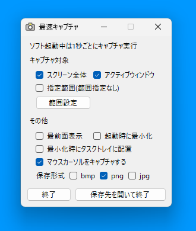

# 最速キャプチャ
 
起動と同時に定期キャプチャを開始します。起動中は1秒毎（変更可能）にキャプチャを行い、自動で保存します。

## 概要

* 起動中は定期キャプチャを実行し、終了でキャプチャを停止します。  
* キャプチャ画像はソフトウェアと同じ場所にある`captureImage`フォルダに自動で保存されます。  
* キャプチャ対象としてスクリーン全体、アクティブウィンドウ、指定範囲を選択できます。  
* キャプチャをする間隔はソフトウェアと同じ場所に作成される`SaisokuCapture.ini`の`msec=1000`の部分で変更可能です。初期設定は`msec=1000`で1秒間隔でキャプチャを実行します。
* 下の画像に表示されている内容が設定の全てです。たまに使うときでも、すぐ使えるようにシンプルな設計にしています。  

  

## 動作確認環境

Microsoft Windows11 x64

## 更新履歴

v1.0.1  
* 保存するファイル名の中にファイル名に使えない文字がある場合はアンダーバーに置き換える処理を追加  

v1.0.0  
* 公開  

## ライセンス

This software is released under the MIT License.  
詳細については、[LICENSE](./LICENSE) ファイルを参照してください。
