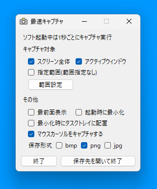

# 最速キャプチャ
 
起動と同時に定期キャプチャを開始します。1秒毎（変更可能）にキャプチャを行い自動で保存します。

## 概要

* 起動中は定期キャプチャを実行し、終了でキャプチャを停止します。  
* キャプチャ画像は自動で保存されます。  
* キャプチャ対象としてスクリーン全体、アクティブウィンドウ、指定範囲を選択できます。  
* キャプチャをする間隔はフォルダ内に作成される`SaisokuCapture.ini`の`msec=1000`の部分で設定します。初期設定は`msec=1000`で1秒間隔でキャプチャを実行します。
* 下の画像に表示されている内容が設定の全てです。たまに使うときでも、すぐ使えるようにシンプルな設計にしています。  

  

## 動作確認環境

Microsoft Windows10 x64 + .NET Framework 4.8

## ライセンス

This software is released under the MIT License.  
詳細については、[LICENSE](./LICENSE) ファイルを参照してください。
